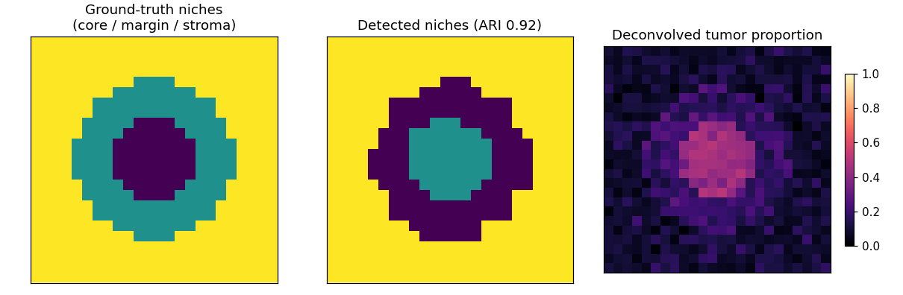

# `spatial-niche-mapper`

 

> **Capability portrait, not a research result.** All data is synthetic and
> deterministically generated; the demo is byte-reproducible on a single
> workstation in seconds. No patient data and no proprietary code or parameters
> are present in this repository.

**What this shows**: the spatial-transcriptomics analysis axis of computational
oncology — (1) **spot deconvolution**, estimating per-spot cell-type proportions
from a Visium-style spot × gene matrix against a single-cell reference signature
(non-negative least squares); and (2) **spatial niche detection**, building a
neighborhood graph over spot coordinates and clustering recurrent tissue niches
(tumor-core vs immune-infiltrated vs stroma), scored against a known ground truth.

**Reproducibility**: `make run` produces the metrics artifact in seconds, no
network and no GPU. Everything is seeded.

**Substrate**: emits a hash-chained NDJSON audit ledger, tracks MLflow runs
(no-op when no server is configured), and exposes a deterministic canary the lab
monitoring layer probes daily.

**Production framing**: methods in this class — reference-based spot
deconvolution and neighborhood niche analysis — are applied to real Visium /
Xenium cohorts in practice (RCTD, SpatialDWLS, cell2location, squidpy). This
repository implements the **method and the engineering** from public building
blocks only, on synthetic data. See
[`docs/what-is-out-of-scope.md`](docs/what-is-out-of-scope.md).

---

## The capability, in one diagram

```
 synthetic Visium-style section (spot × gene + coordinates + ground-truth niches)
        │
        ├── deconv.deconvolve   → per-spot cell-type proportions (NNLS vs
        │     single-cell reference signatures), validated against truth
        │
        └── niche.detect_niches → spatial k-NN graph over coordinates →
              per-spot neighbourhood composition → KMeans niches →
              ARI vs ground-truth regions
```



*Left: ground-truth concentric niches (tumor core / immune margin / stroma).
Middle: niches detected from deconvolved composition (recover the same
structure). Right: deconvolved tumor-cell proportion, concentrated in the core.*

## Demo results (synthetic, seed 0)

A 24×24 spot section (576 spots, 120 genes, 6 cell types):

| Metric | Value |
|---|---|
| Deconvolution mean per-cell-type correlation (est vs true proportions) | **0.918** |
| Deconvolution mean absolute error (proportions) | **0.060** |
| Niche-recovery ARI (detected niches vs ground-truth regions) | **0.921** |

These describe *this synthetic dataset* — an illustration of the method working
end to end, not a benchmark claim about real tissue.

## Quickstart

```bash
make install     # uv sync, or pip install -e ".[dev]"
make run         # -> artifacts/demo.json
make test        # pytest
make lint        # ruff
make canary      # deterministic deconvolution-recovery check
```

## Layout

```
.
├── README.md
├── LICENSE                      # MIT
├── Makefile
├── pyproject.toml               # [spatial] extra = scanpy/squidpy/anndata
├── .github/workflows/           # ci.yml + english-only.yml
├── data/manifest.yaml           # public Visium/Xenium datasets + methods targeted
├── src/spatialniche/
│   ├── synth.py                 # deterministic Visium-style section + ground truth
│   ├── deconv.py                # NNLS spot deconvolution + accuracy metrics
│   ├── niche.py                 # spatial k-NN neighbourhood + KMeans niches + ARI
│   ├── pipeline.py              # CLI entry; audit + MLflow shape
│   └── audit.py / tracking.py / canary.py   # shared substrate
└── docs/
    ├── figures/niche_map.png
    ├── architecture.md
    ├── what-is-out-of-scope.md
    └── release-notes/v0.1.md
```

## On real data

The demo is synthetic; the code is written against a real-data shape. To adapt:
load a Visium/Xenium spot × gene matrix + coordinates and a matched single-cell
reference (install `pip install -e ".[spatial]"` for scanpy / squidpy / anndata),
pass the reference signatures to `deconv.deconvolve`, then `niche.detect_niches`.
The public methods this models are catalogued in
[`data/manifest.yaml`](data/manifest.yaml).

## License

MIT. See [`LICENSE`](LICENSE).
